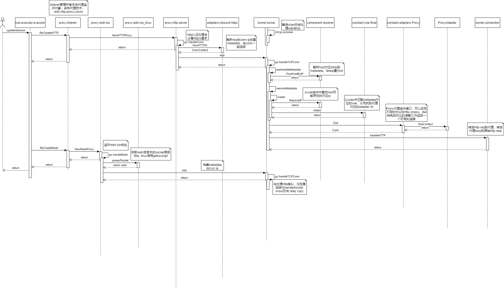

# Clash

clash作为一个客户端代理软件，可以支持

* 多种代理服务协议
* tcp,udp 重定向透明代理
* 基于规则的节点分流
* ...

## 大体流程

下面解析clash的基本结构，看如何实现

从宏观上看，如果要在linux实现透明代理，首先要使用iptables重定向流量到指定端口，然后使用解析packet如redir后丢失的target ip、http代理协议连接等，再找出packet对应规则关联的代理节点，最后使用代理转发packet的请求与响应。



### 启动本地代理

`hub/executor/executor.go`用于解析配置并启动clash。对应方法`updateGeneral`启动所有配置的本地代理：redir, http, socks, mixed, tproxy。由于goroutine，所有recreate方法都会立即返回

```go
func updateGeneral(general *config.General, force bool) {
    // ...
	if err := P.ReCreateHTTP(general.Port); err != nil {//..}
	if err := P.ReCreateSocks(general.SocksPort); err != nil {//..}
	if err := P.ReCreateRedir(general.RedirPort); err != nil {//..}
	if err := P.ReCreateTProxy(general.TProxyPort); err != nil {//..}
	if err := P.ReCreateMixed(general.MixedPort); err != nil {//..}
}
```

`proxy/listener.go`保存所有代理实例，分派代理的创建。对应的各种代理实现都在`proxy/xxx/`中。

启动代理listener后都在指定的端口上监听，下一步解析处理代理流量

### 解析代理packet metadata

注意redir与http代理不同，由于在linux上redir后会丢失packet dst ip，无法发送出去。对于tcp可以用getsockopt中的SO_ORIGINAL_DST来获取，对于udp <!-* todo -->

```go
// tcp
// Call getorigdst() from linux/net/ipv4/netfilter/nf_conntrack_l3proto_ipv4.c
func getorigdst(fd uintptr) (socks5.Addr, error) {
	raw := syscall.RawSockaddrInet4{}
	siz := unsafe.Sizeof(raw)
	if err := socketcall(GETSOCKOPT, fd, syscall.IPPROTO_IP, SO_ORIGINAL_DST, uintptr(unsafe.Pointer(&raw)), uintptr(unsafe.Pointer(&siz)), 0); err != nil {
		return nil, err
	}

	addr := make([]byte, 1+net.IPv4len+2)
	addr[0] = socks5.AtypIPv4
	copy(addr[1:1+net.IPv4len], raw.Addr[:])
	port := (*[2]byte)(unsafe.Pointer(&raw.Port)) // big-endian
	addr[1+net.IPv4len], addr[1+net.IPv4len+1] = port[0], port[1]
	return addr, nil
}
// udp 更复杂，可以查看代码：`proxy/redir/udp.go::NewRedirUDPProxy`
```

从tcp 连接中或udp packet中解析出dst ip与src ip及对应端口封装为Metadata。到了这里，就完成了本地代理接收工作，可以准备下一步，同时继续监听本地代理packet

`tunnel/tunnel.go`是packet分派中心，所有本地代理上的流量都将被发送到tunnel上的chan中被分流代理转发

### 匹配Rule

在匹配前根据rule, dns要进一步完善metadata host, ip。

```go
type Rule interface {
	RuleType() RuleType
	Match(metadata *Metadata) bool
	Adapter() string
	Payload() string
	ShouldResolveIP() bool
}
```

Rule有多种实现在`rules/xxx`，可配置关联的proxy group，`proxies = make(map[string]C.Proxy)`通过`Adapter()`索引一个packet对应的rule关联的proxy

### proxy转发

在找到对应的Proxy后，通过`Dial(metadata)`完成各种协议的准备工作并返回一个tcp:`net.Conn`,udp:`net.PacketConn`（Connection用于restful追踪chains，不是重点），接下来转发只要在Conn中读写即可。具体代码在`tunnel/connection.go`中处理

```go
type Proxy interface {
	ProxyAdapter
	Alive() bool
	DelayHistory() []DelayHistory
	Dial(metadata *Metadata) (Conn, error)
	LastDelay() uint16
	URLTest(ctx context.Context, url string) (uint16, error)
}
```

Proxy只是最高层接口，`constant/adapters.go::ProxyAdapter`才是各种协议实现接口。可以在`adapters/outbound/xxx`查看实现

参考：

* [V2Ray 源代码分析 你也能撸一个 V2Ray](https://medium.com/@jarvisgally/v2ray-%E6%BA%90%E4%BB%A3%E7%A0%81%E5%88%86%E6%9E%90-b4f8db55b0f6)
* [clash v1.6.0](https://github.com/Dreamacro/clash/releases/tag/v1.6.0)
* [Linux transparent proxy support](https://powerdns.org/tproxydoc/tproxy.md.html)
* [从 ss-redir 的实现到 Linux NAT](https://vvl.me/2018/06/from-ss-redir-to-linux-nat/)
